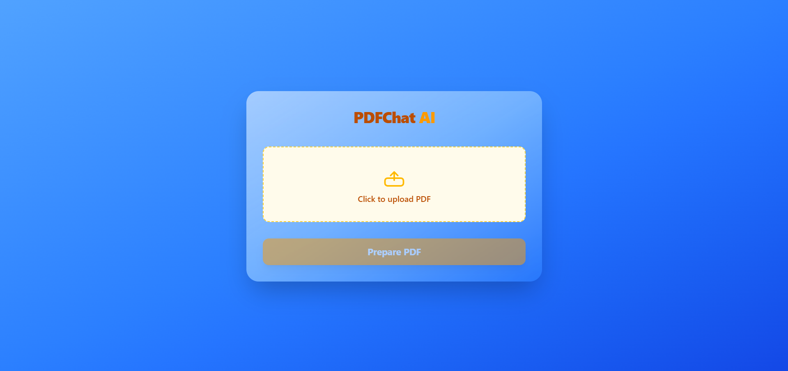

# PDFChat AI 🤖📄
Website: [https://pdfchat-ai-frontend.vercel.app](https://pdfchat-ai-frontend.vercel.app)

A modern web application that allows you to chat with your PDF documents using AI. Upload any PDF file and have intelligent conversations about its content with the help of Google's Gemini AI and advanced vector search capabilities.


## ✨ Features

- **📄 PDF Upload & Processing**: Upload PDF files and automatically extract and index their content.
- **🤖 AI-Powered Chat**: Chat with your PDF documents using Google's Gemini 2.5 Pro model.
- **🔍 Intelligent Search**: Advanced vector search using Qdrant vector database for accurate responses.
- **📱 Modern UI**: Beautiful, responsive interface built with React and Tailwind CSS.
- **⚡ Real-time Processing**: Fast document indexing with parallel processing capabilities.
- **🔄 Session Management**: Maintain chat sessions with automatic cleanup.
- **📊 Page Summarization**: Each page is intelligently summarized for better context understanding.

## 🛠️ Tech Stack

### Frontend
- **React** - Modern React with latest features
- **Vite** - Fast build tool and development server
- **Tailwind CSS** - Utility-first CSS framework
- **Axios** - HTTP client for API communication

### Backend
- **Node.js** - JavaScript runtime
- **Express.js** - Web application framework
- **LangChain/LangGraph** - AI/LLM application framework
- **Google Generative AI** - Gemini 2.5 Pro model
- **Qdrant** - Vector database for semantic search
- **PDF Parse** - PDF text extraction
- **Multer** - File upload handling

### Infrastructure
- **Docker Compose** - Container orchestration for Qdrant
- **Environment Variables** - Secure configuration management

## 🚀 Quick Start

### Prerequisites

- Node.js (v18 or higher)
- npm or yarn
- Docker and Docker Compose
- Google AI API key(s)

### Installation

1. **Clone the repository**
   ```bash
   git clone https://github.com/dhruvagrawal1080/PDF-Chat.git
   cd PDF-Chat
   ```

2. **Set up environment variables**

   Create `.env` files in both `backend/` and `frontend/` directories:

   **Backend (.env)**
   ```env
   PORT=3000
   FRONTEND_URL=http://localhost:5173
   GOOGLE_API_KEY1=your_google_api_key_here
   GOOGLE_API_KEY2=your_second_api_key_here
   GOOGLE_API_KEY3=your_third_api_key_here
   GOOGLE_API_KEY4=your_fourth_api_key_here
   GOOGLE_API_KEY5=your_fifth_api_key_here
   QDRANT_URL=your_qdrant_cloud_url_here
   QDRANT_API_KEY=your_qdrant_api_key_here
   ```

   **Frontend (.env)**
   ```env
   VITE_BACKEND_URL=http://localhost:3000
   ```

3. **Start the vector database**
   ```bash
   cd backend
   docker-compose up -d
   ```

4. **Install backend dependencies**
   ```bash
   cd backend
   npm install
   ```

5. **Install frontend dependencies**
   ```bash
   cd frontend
   npm install
   ```

6. **Start the development servers**

   **Backend (Terminal 1)**
   ```bash
   cd backend
   npm run dev
   ```

   **Frontend (Terminal 2)**
   ```bash
   cd frontend
   npm run dev
   ```

7. **Open your browser**
   Navigate to `http://localhost:5173` to access the application.

## 📖 Usage

1. **Upload a PDF**: Click the upload area to upload a PDF file.
2. **Wait for Processing**: The system will automatically extract, index, and summarize your PDF.
3. **Start Chatting**: Ask questions about your PDF content in natural language.
4. **Get Intelligent Responses**: Receive accurate, context-aware answers based on your document.

## 🔧 Configuration

### API Keys Setup

1. **Google AI API**: Get your API keys from [Google AI Studio](https://makersuite.google.com/app/apikey)
2. **Multiple Keys**: The system supports multiple API keys for load balancing and rate limiting
3. **Qdrant**: Optional API key for production deployments

### Environment Variables

| Variable | Description | Default |
|----------|-------------|---------|
| `PORT` | Backend server port | `3000` |
| `FRONTEND_URL` | Frontend URL for CORS | `http://localhost:5173` |
| `GOOGLE_API_KEY1-5` | Google AI API keys | Required |
| `QDRANT_URL` | Qdrant vector database URL | Optional |
| `QDRANT_API_KEY` | Qdrant API key | Optional |

## 🏗️ Project Structure

```
PDFChat-web-app/
├── backend/
│   ├── controllers/         # Request handlers
│   ├── routes/              # API routes
│   ├── utils/               # Utility functions
│   │   ├── chat.js          # Chat functionality
│   │   ├── indexing.js      # PDF processing & indexing
│   │   └── memoryStore.js   # Session management
│   ├── docker-compose.yml   # Qdrant container setup
│   ├── package.json         # Backend dependencies
│   └── server.js            # Express server
├── frontend/
│   ├── src/
│   │   ├── components/        # React components
│   │   │   ├── ChatBox.jsx    # Chat interface
│   │   │   ├── PdfHeader.jsx  # Header component
│   │   │   └── PdfUpload.jsx  # File upload component
│   │   ├── App.jsx            # Main application
│   │   └── main.jsx           # Entry point
│   ├── public/                # Static assets
│   └── package.json           # Frontend dependencies
└── README.md                  
```

## 🤝 Contributing

1. Fork the repository
2. Create a feature branch (`git checkout -b feature/amazing-feature`)
3. Commit your changes (`git commit -m 'Add some amazing feature'`)
4. Push to the branch (`git push origin feature/amazing-feature`)
5. Open a Pull Request
---

**Made with ❤️ for intelligent document conversations** 